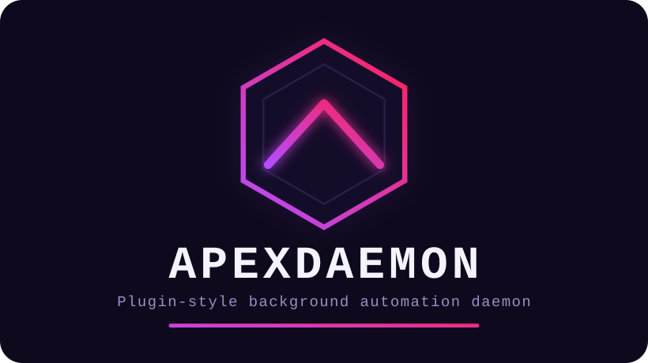

<p align="center">
  
</p>

Plugin-style background automation daemon. Each automation area is an
independent module behind one `Plugin` trait (`src/plugin.rs`), individually
enabled/disabled in config — not dynamically loaded, just cleanly separated,
since everything ships and rebuilds together anyway.

## Plugins

- **theme-sync** — watches `~/.local/state/omarchy/current` for a theme
  switch, converts `colors.toml` into a cybercore CYBERGRID theme file via
  `ansi2cybergrid.py`. Writes land in a dedicated `omarchy-live` family, kept
  separate from the 72 hand-curated themes. Consumers of cybercore still need
  a rebuild to pick up new theme data — this plugin keeps the source file
  current, it doesn't live-reload anything.
- **fleet-health** — polls configured services (TCP/HTTP/systemd-unit checks)
  and runs a `start_cmd` if one's down. Never kills or restarts an existing
  process — start-only, alert-only otherwise.
- **security** — watches a configured systemd unit (`vortexwall` today,
  swappable to `fail2ban` later via config alone) for activity and tails its
  journal for ban events. Observe-and-alert only; never starts the unit.
- **vault-backup** — auto-commits a dirty vault repo on an interval, with an
  opt-in push. Push runs with `GIT_TERMINAL_PROMPT=0` so an SSH remote
  needing a passphrase fails fast instead of hanging a headless daemon.
- **repo-housekeeping** — reuses cyberfleet's own repo list
  (`~/.config/cyberfleet/config.json`) when present, checks local
  dirty/ahead/behind status via `git2`, fetches non-interactively, and polls
  a small `owner/repo#N` watchlist via `gh` for state changes.

## Config

```
cp config.example.toml ~/.config/apexdaemon/config.toml
```

Every field in the example is also the built-in default — an absent or
empty config file runs every plugin with those same values.

## Running

```
cargo build --release
./target/release/apexdaemon --dry-run     # see what it would do first
./target/release/apexdaemon --list-plugins
```

`--dry-run` logs every plugin's intended action (restart, commit, push,
fetch, theme write) without doing it.

## Contributing

```bash
./scripts/release-gates quick   # fmt/check/clippy only
./scripts/release-gates full    # + tests + cargo-deny
```

One-time setup to run `release-gates quick` automatically before every
commit:

```bash
git config core.hooksPath .githooks
```

## Service

Nothing this daemon does needs root, so it's a `systemd --user` service, not
a system one:

```
systemctl --user link ~/tools/daemons/apexdaemon/apexdaemon.service
systemctl --user enable --now apexdaemon
```

Or use the built-in wrapper (same `--admin` convention as wraithflow and
vortexwall, but targeting the user manager):

```
apexdaemon --admin --start
apexdaemon --admin --status
```
