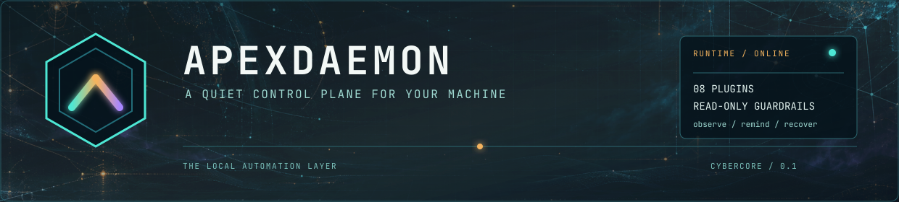
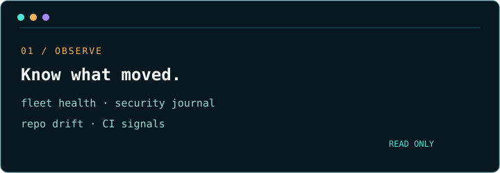
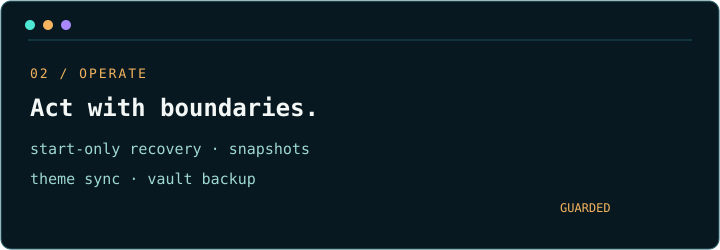
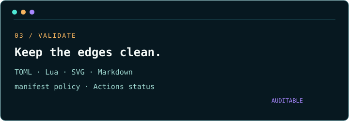

<p align="center">
  <picture>
    <source media="(max-width: 600px)" srcset="assets/header-command-center-mobile.png">
    
  </picture>
</p>

<p align="center">
  <a href="https://github.com/darkstardevx/apexdaemon/actions/workflows/ci.yml"></a>
  <a href="https://github.com/darkstardevx/apexdaemon/actions/workflows/release.yml"></a>
  <a href="https://github.com/darkstardevx/apexdaemon/releases"></a>
</p>

<p align="center">
  <strong>Observe the machine. Automate the boring edges. Keep the guardrails visible.</strong><br>
  A plugin-style background automation daemon for service health, dotfiles, repositories, security signals, and local recovery.
</p>

<p align="center">
  
</p>

## The control surface

ApexDaemon is deliberately small at the center and broad at the edges. Each automation area is an independent module behind one `Plugin` trait, individually enabled in configuration and supervised as a long-running task.

<p align="center"></p>

<p align="center"></p>

<p align="center"></p>

## Install

```bash
curl -fsSL https://raw.githubusercontent.com/darkstardevx/apexdaemon/main/install.sh | sh
```

The installer downloads the latest release for Linux or macOS on x86_64 or aarch64, verifies its SHA-256 checksum, and installs `apexdaemon` to `~/.local/bin`.

Build from source instead:

```bash
cargo build --release
```

## Start with a read-only pass

```bash
apexdaemon --list-plugins
apexdaemon --dry-run
```

The dry-run reports intended actions without restarting services, committing, pushing, fetching, or writing theme files.

## Plugin map

- `theme-sync` — converts the active Omarchy theme into a Cybercore theme file; writes only to the dedicated `omarchy-live` family.
- `fleet-health` — polls TCP, HTTP, and systemd services; recovery is start-only, and services without a start command stay alert-only.
- `security` — watches a systemd security unit and its journal; observes and alerts, but never starts the unit.
- `vault-backup` — commits a configured vault repo, with optional non-interactive push.
- `repo-housekeeping` — reuses Cyberfleet repo discovery and reports dirty/ahead/behind state.
- `dotfiles` — audits public/private bare dotfiles repositories with explicit manifests and high-confidence secret scanning.
- `profiles` — validates machine identity and manifest wiring, then reminds on mismatch.
- `validation` — checks local assets and GitHub Actions workflow state; it never dispatches, reruns, commits, pushes, or publishes.

### Omarchy theme-sync details

The `theme-sync` plugin watches Omarchy's active theme at
`~/.local/state/omarchy/current/theme/colors.toml` and writes generated
Cybercore JSON into the isolated `omarchy-live` family. It is deliberately
safe to run alongside hand-curated Cybercore themes: it does not overwrite
those themes, and it does not modify the Omarchy installation itself.

The incident that motivated the current implementation is documented in
[`docs/THEME-SYNC.md`](docs/THEME-SYNC.md), including the original error,
root cause, exact recovery behavior, and verification procedure.

Two details matter when authoring or switching themes:

- Omarchy replaces the active theme directory in several filesystem steps.
  ApexDaemon waits for a complete palette before syncing, so the transient
  `mode = "dark"` file seen during a switch is ignored rather than reported
  as a real parse failure.
- Both palette shapes are supported: generated themes with `cursor` and
  `color0` through `color15`, and semantic-only themes such as `background`,
  `foreground`, `red`, `green`, and their bright variants. Missing cursor and
  ANSI slots are derived from the semantic colors; genuinely incomplete files
  still fail after the bounded retry window.

After a successful sync, running Cybercore consumers must still be rebuilt to
embed the new theme data. To inspect sync activity:

```bash
journalctl --user -u apexdaemon.service -f
```

## Configuration

```bash
mkdir -p ~/.config/apexdaemon
cp config.example.toml ~/.config/apexdaemon/config.toml
```

The established system plugins default on. The dotfiles, profiles, and validation plugins are opt-in until their paths and policy have been reviewed.

### Dotfiles guardrails

```toml
[plugins]
dotfiles = true
profiles = true
validation = true

[dotfiles]
public_manifest = "~/.config/apexdaemon/public-files.list"
private_manifest = "~/.config/apexdaemon/private-files.list"
auto_commit = false
auto_push = false

[validation]
interval_secs = 3600
watch_ci = true
workflow = "ci.yml"
repositories = ["darkstardevx/apexdaemon"]
notify_success = false
```

Manifests are explicit allow-lists, with one path relative to `$HOME` per line. Keep credentials, private keys, session files, generated logs, and vaults outside them.

### Read-only CI reminders

The validation plugin calls the authenticated `gh run list` command for the configured workflow. It reports the latest state, but never dispatches, cancels, reruns, commits, pushes, or publishes anything. The `gh` CLI must already be authenticated.

## Local checkpoints

Preview a snapshot:

```bash
apexdaemon --dotfiles-snapshot --dry-run
```

Create one:

```bash
apexdaemon --dotfiles-snapshot
```

Restore a known checkpoint without deleting extra files:

```bash
apexdaemon --dotfiles-rollback SNAPSHOT_ID --dry-run
apexdaemon --dotfiles-rollback SNAPSHOT_ID
```

Snapshots copy only manifest-listed files into the configured local state directory. Rollback never commits, pushes, deletes unrelated files, or switches profiles.

## Service mode

ApexDaemon runs as a `systemd --user` service and does not require root:

```bash
systemctl --user link ~/tools/daemons/apexdaemon/apexdaemon.service
systemctl --user enable --now apexdaemon
```

Or use the built-in admin wrapper:

```bash
apexdaemon --admin --start
apexdaemon --admin --status
```

## Quality gates

```bash
./scripts/release-gates quick   # fmt, check, Clippy
./scripts/release-gates full    # quick + tests + cargo-deny
```

The project also ships CI for formatting, Clippy, tests, and supply-chain checks, plus a release workflow for Linux and macOS binaries.

## Asset pack

The visual system lives under [`assets/`](assets/):

- `header-command-center.svg` — desktop-wide header aligned to the README content rail
- `header-command-center-mobile.svg` — stacked mobile header selected below 600px
- `header-command-center.png` — raster preview/export of the desktop header
- `header-command-center-mobile.png` — raster mobile export for reliable small-screen rendering
- `apexdaemon-command-field.png` — atmospheric command-field background
- `logo-command-node.svg` — compact cyan/amber command-node mark
- `cards/` — responsive Observe, Operate, and Validate capability cards

## License

MIT. See [`LICENSE`](LICENSE).
